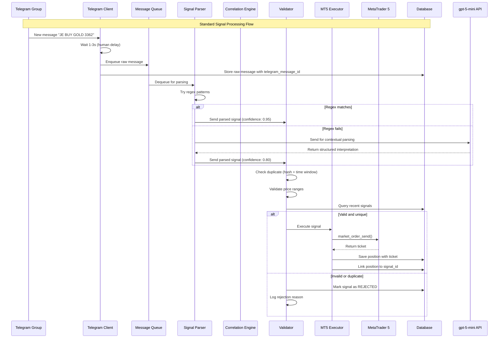
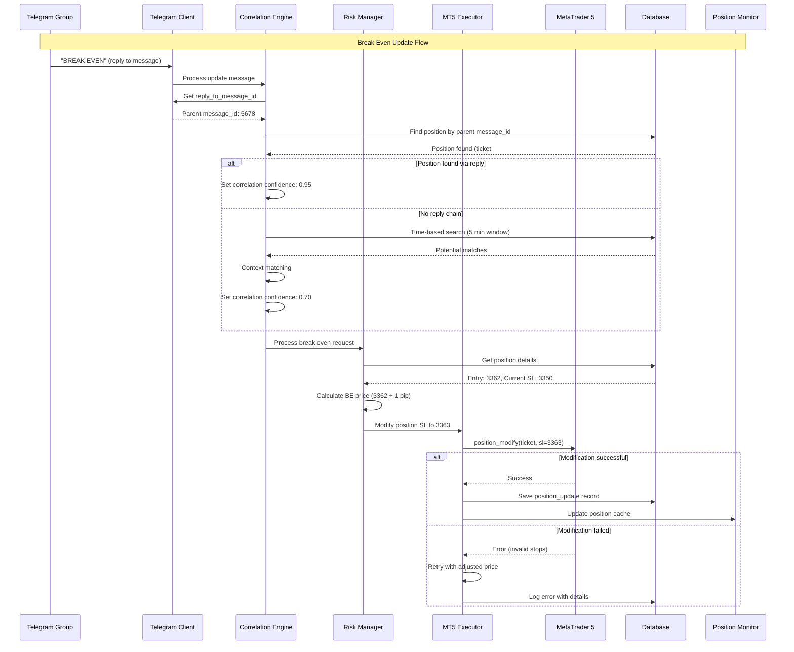
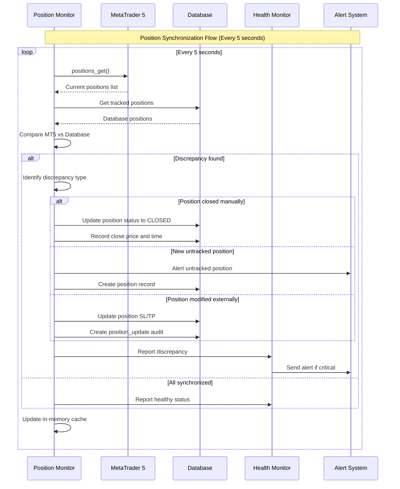
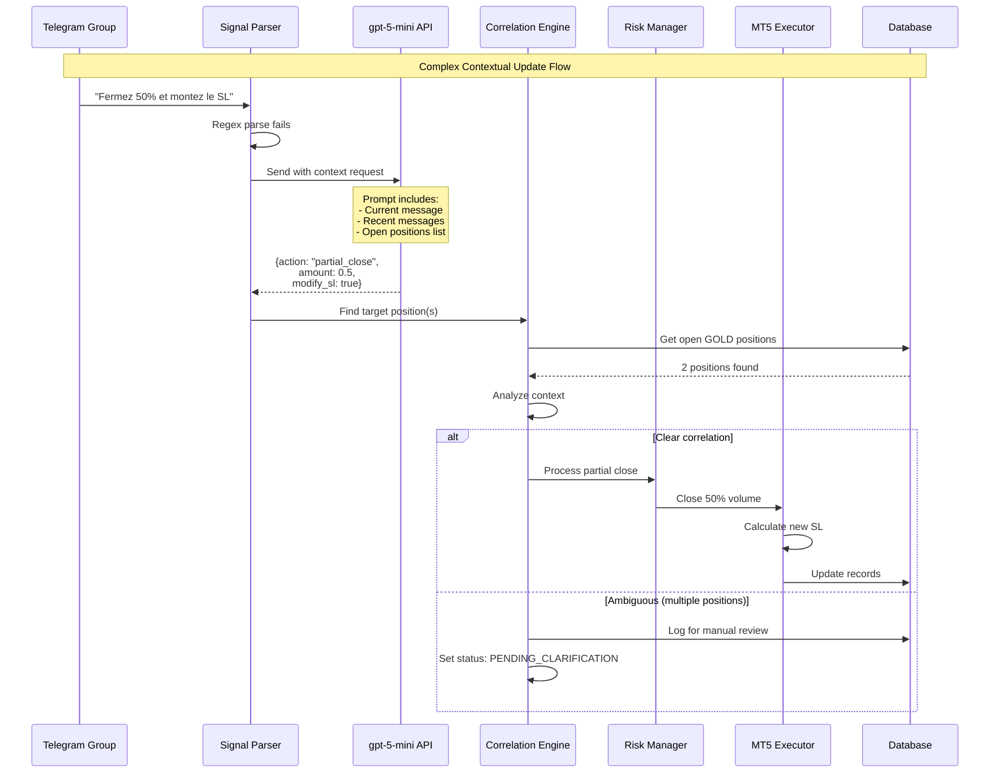

# Core Workflows

```mermaid
sequenceDiagram
    participant TG as Telegram Group
    participant TC as Telegram Client
    participant MQ as Message Queue
    participant SP as Signal Parser
    participant CE as Correlation Engine
    participant VAL as Validator
    participant EX as MT5 Executor
    participant MT5 as MetaTrader 5
    participant DB as Database
    participant GPT as gpt-5-mini API

    Note over TG,DB: Standard Signal Processing Flow
    
    TG->>TC: New message "JE BUY GOLD 3362"
    TC->>TC: Wait 1-3s (human delay)
    TC->>MQ: Enqueue raw message
    TC->>DB: Store raw message with telegram_message_id
    
    MQ->>SP: Dequeue for parsing
    SP->>SP: Try regex patterns
    alt Regex matches
        SP->>VAL: Send parsed signal (confidence: 0.95)
    else Regex fails
        SP->>GPT: Send for contextual parsing
        GPT-->>SP: Return structured interpretation
        SP->>VAL: Send parsed signal (confidence: 0.80)
    end
    
    VAL->>VAL: Check duplicate (hash + time window)
    VAL->>VAL: Validate price ranges
    VAL->>DB: Query recent signals
    
    alt Valid and unique
        VAL->>EX: Execute signal
        EX->>MT5: market_order_send()
        MT5-->>EX: Return ticket #12345
        EX->>DB: Save position with ticket
        EX->>DB: Link position to signal_id
    else Invalid or duplicate
        VAL->>DB: Mark signal as REJECTED
        VAL->>VAL: Log rejection reason
    end
```

```mermaid
sequenceDiagram
    participant TG as Telegram Group
    participant TC as Telegram Client
    participant CE as Correlation Engine
    participant RM as Risk Manager
    participant EX as MT5 Executor
    participant MT5 as MetaTrader 5
    participant DB as Database
    participant PM as Position Monitor

    Note over TG,PM: Break Even Update Flow
    
    TG->>TC: "BREAK EVEN" (reply to message)
    TC->>CE: Process update message
    CE->>TC: Get reply_to_message_id
    TC-->>CE: Parent message_id: 5678
    
    CE->>DB: Find position by parent message_id
    DB-->>CE: Position found (ticket #12345)
    
    alt Position found via reply
        CE->>CE: Set correlation confidence: 0.95
    else No reply chain
        CE->>DB: Time-based search (5 min window)
        DB-->>CE: Potential matches
        CE->>CE: Context matching
        CE->>CE: Set correlation confidence: 0.70
    end
    
    CE->>RM: Process break even request
    RM->>DB: Get position details
    DB-->>RM: Entry: 3362, Current SL: 3350
    
    RM->>RM: Calculate BE price (3362 + 1 pip)
    RM->>EX: Modify position SL to 3363
    
    EX->>MT5: position_modify(ticket, sl=3363)
    alt Modification successful
        MT5-->>EX: Success
        EX->>DB: Save position_update record
        EX->>PM: Update position cache
    else Modification failed
        MT5-->>EX: Error (invalid stops)
        EX->>EX: Retry with adjusted price
        EX->>DB: Log error with details
    end
```

```mermaid
sequenceDiagram
    participant PM as Position Monitor
    participant MT5 as MetaTrader 5
    participant DB as Database
    participant HM as Health Monitor
    participant Alert as Alert System

    Note over PM,Alert: Position Synchronization Flow (Every 5 seconds)
    
    loop Every 5 seconds
        PM->>MT5: positions_get()
        MT5-->>PM: Current positions list
        
        PM->>DB: Get tracked positions
        DB-->>PM: Database positions
        
        PM->>PM: Compare MT5 vs Database
        
        alt Discrepancy found
            PM->>PM: Identify discrepancy type
            
            alt Position closed manually
                PM->>DB: Update position status to CLOSED
                PM->>DB: Record close price and time
            else New untracked position
                PM->>Alert: Alert untracked position
                PM->>DB: Create position record
            else Position modified externally
                PM->>DB: Update position SL/TP
                PM->>DB: Create position_update audit
            end
            
            PM->>HM: Report discrepancy
            HM->>Alert: Send alert if critical
        else All synchronized
            PM->>HM: Report healthy status
        end
        
        PM->>PM: Update in-memory cache
    end
```

```mermaid
sequenceDiagram
    participant TG as Telegram Group
    participant SP as Signal Parser
    participant GPT as gpt-5-mini API
    participant CE as Correlation Engine
    participant RM as Risk Manager
    participant EX as MT5 Executor
    participant DB as Database

    Note over TG,DB: Complex Contextual Update Flow
    
    TG->>SP: "Fermez 50% et montez le SL"
    SP->>SP: Regex parse fails
    
    SP->>GPT: Send with context request
    Note over GPT: Prompt includes:<br/>- Current message<br/>- Recent messages<br/>- Open positions list
    
    GPT-->>SP: {action: "partial_close",<br/>amount: 0.5,<br/>modify_sl: true}
    
    SP->>CE: Find target position(s)
    CE->>DB: Get open GOLD positions
    DB-->>CE: 2 positions found
    
    CE->>CE: Analyze context
    alt Clear correlation
        CE->>RM: Process partial close
        RM->>EX: Close 50% volume
        EX->>EX: Calculate new SL
        EX->>DB: Update records
    else Ambiguous (multiple positions)
        CE->>DB: Log for manual review
        CE->>CE: Set status: PENDING_CLARIFICATION
    end
```
