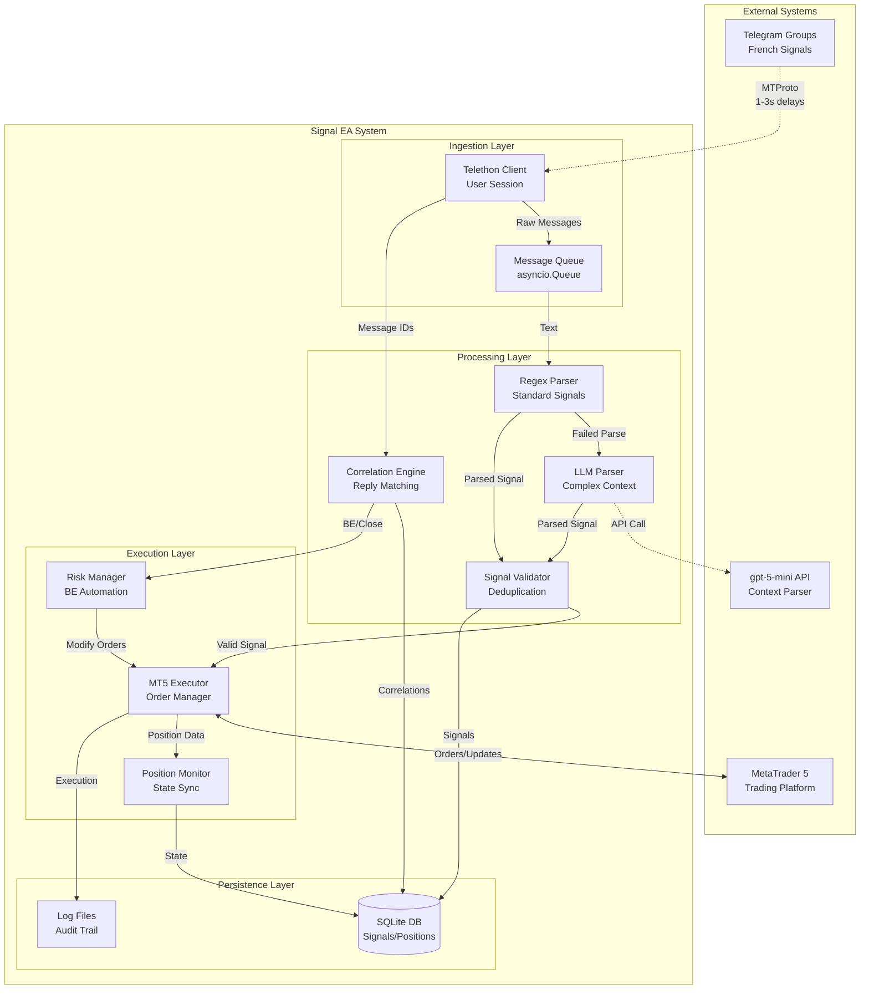

# High Level Architecture

## Technical Summary

The Telegram Trading Signal EA employs an **event-driven async pipeline architecture** built on Python's asyncio framework, processing French trading signals through a three-stage pipeline: Telegram message ingestion via MTProto, intelligent parsing combining regex and gpt-5-mini, and MT5 trade execution. The system leverages **message correlation patterns** to maintain context across trading updates, uses **SQLite for persistent state management**, and implements **human-like rate limiting** to ensure sustainable 24/5 operation. This architecture directly supports the PRD goals of sub-2-second execution latency and 100% signal capture rate while maintaining operational costs under €50/month.

## High Level Overview

1. **Architectural Style:** Event-Driven Pipeline with Async/Await patterns - chosen for real-time message processing and concurrent operations
2. **Repository Structure:** Monorepo as specified in PRD - single Python application with modular components
3. **Service Architecture:** Monolithic application with internal module separation - avoiding microservices overhead for MVP
4. **Primary Data Flow:** 
   - Telegram Group → Telethon Client (User Session) → Message Queue
   - Message Queue → Parser Pipeline (Regex → gpt-5-mini fallback) → Signal Queue  
   - Signal Queue → Validation → MT5 Executor → Position Tracker
   - Context Updates → Correlation Engine → Position Modifications
5. **Key Architectural Decisions:**
   - **Async-first design** for handling concurrent Telegram events and MT5 operations
   - **Queue-based decoupling** between stages to prevent message loss during processing bottlenecks
   - **Hybrid parsing strategy** (regex primary, LLM fallback) to minimize API costs
   - **Message correlation via reply chains** for accurate position update targeting

## High Level Project Diagram

## Architectural and Design Patterns

- **Event-Driven Architecture:** Python asyncio event loops for real-time Telegram message processing - *Rationale:* Natural fit for reacting to incoming Telegram messages and maintaining multiple concurrent connections
- **Pipeline Pattern:** Three-stage processing (Ingestion → Processing → Execution) with queue buffers - *Rationale:* Enables independent scaling of each stage and prevents message loss during processing spikes
- **Repository Pattern:** Abstract database operations behind async repository interfaces - *Rationale:* Clean separation of business logic from SQLite implementation, enables testing with mocks
- **Circuit Breaker Pattern:** For OpenAI API and MT5 connections with exponential backoff - *Rationale:* Prevents cascade failures and manages rate limits gracefully per PRD requirements
- **Message Correlation Pattern:** Reply-chain traversal with fallback to time-window matching - *Rationale:* Critical for correctly linking "BREAK EVEN" updates to parent positions in multi-trade scenarios
- **Hybrid Processing Pattern:** Fast regex with intelligent LLM fallback - *Rationale:* Optimizes for sub-2-second latency on standard signals while handling complex French context when needed
